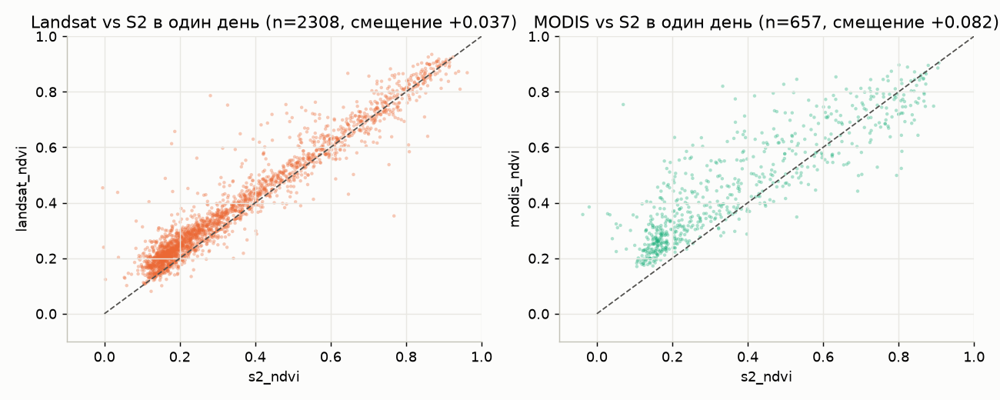
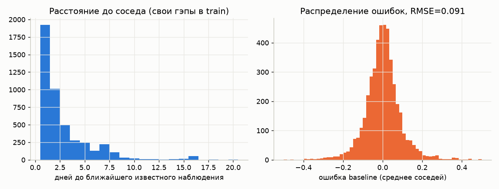
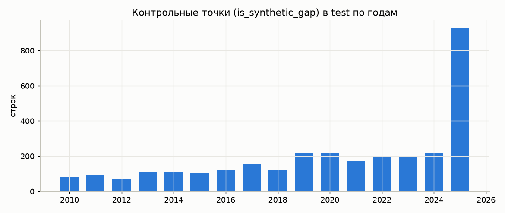
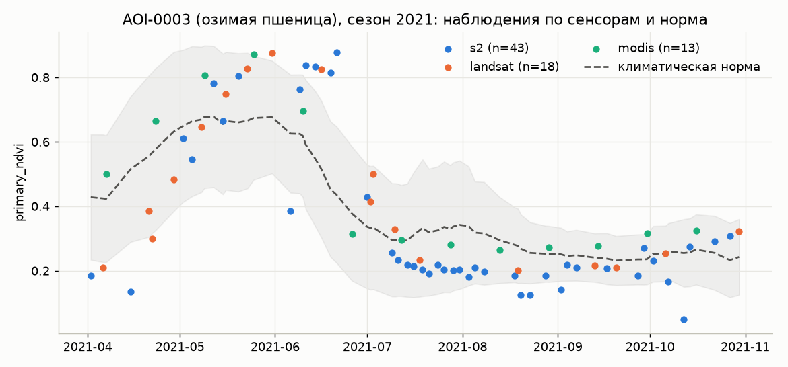
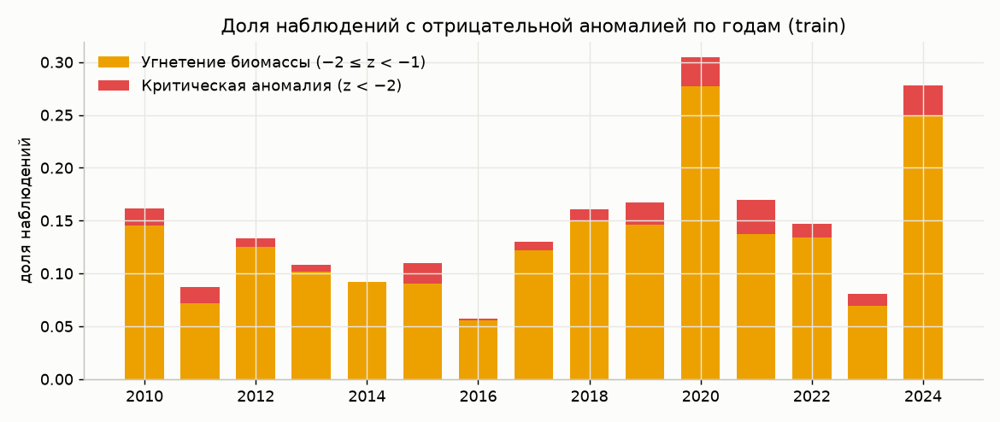
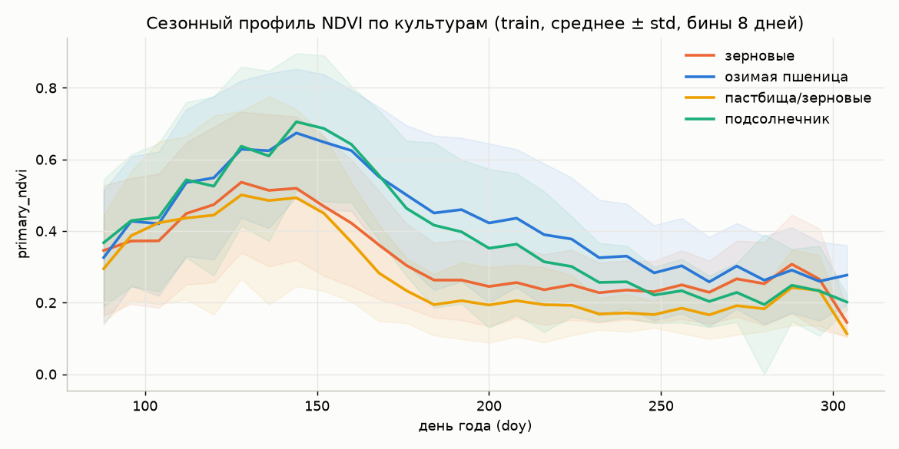

# Данные: описание и результаты EDA

Разведочный анализ `train_dataset.csv` и `test_dataset.csv` под задачу восстановления `primary_ndvi` (задача 1, автометрика) и детекции аномалий (задача 2). Скрипты анализа лежат в [`../eda/`](../eda/), графики в [`../eda/figures/`](../eda/figures/).

> В ТЗ тестовый файл называется `private_features.csv`, у нас он лежит как `test_dataset.csv`.

## 1. Что лежит в файлах

| | train_dataset.csv | test_dataset.csv |
|---|---|---|
| Строк | 99 955 | 57 185 |
| Полигонов | 39 | 78 (все 39 из train + 39 новых) |
| Период | 2010-04-01 … 2024-10-30 | 2010-04-01 … 2025-10-30 |
| Сезон | ежегодно 1 апреля – 30 октября (doy 91–304, 213 дней) | то же |
| Строк с `primary_ndvi` | 30 520 (30,5 %) | 17 641 известных + 3 112 скрытых |
| Уникальных колонок | `ndvi_zscore`, `status` | `is_synthetic_gap` |
| Контрольных точек | — | **3 112** (`is_synthetic_gap = True`) |

Ключ `anon_polygon_id + date` уникален в обоих файлах, дублей нет. Одна строка = один полигон в один день.

### Колонки

| Группа | Колонки | Заметки |
|---|---|---|
| Идентификаторы | `anon_polygon_id`, `date` | |
| Sentinel-2 | `s2_ndvi`, `s2_evi`, `s2_ndwi` | есть только с 2017 г.; `s2_evi` содержит мусорные значения порядка ±1e11 |
| Landsat | `landsat_ndvi`, `landsat_evi`, `landsat_ndwi` | с 2010 г.; есть выбросы NDVI < −0.2 и > 1 |
| MODIS | `modis_ndvi`, `modis_evi` | 16-дневные композиты MOD13Q1, всегда на doy ≡ 1 (mod 16): 97, 113, 129, … |
| ERA5 | `era5_temp_c`, `era5_precip_mm` | суточные; есть только у «плотных» полигонов (см. п. 3) |
| Календарь | `year`, `doy` | |
| Цель | `primary_ndvi` | |
| Норма | `ndvi_climatology_mean`, `ndvi_climatology_std`, `n_reference_years` | заполнены только там, где есть `primary_ndvi` |
| Только train | `ndvi_zscore`, `status` | |
| Только test | `is_synthetic_gap` | |
| Статика | `crop_type` | 4 класса, одна метка на полигон на все 15 лет |

## 2. Главные находки по задаче 1 (восстановление пропусков)

### 2.1. `primary_ndvi` это ровно coalesce(S2 → Landsat → MODIS)

Проверено на 100 % строк train: если есть `s2_ndvi`, берётся он; иначе `landsat_ndvi`; иначе `modis_ndvi`. Ни одного значения `primary_ndvi` без сенсора и ни одного сенсора без `primary_ndvi`.

Следствие: **целевой ряд склеен из трёх сенсоров с разными смещениями**, и скрытая точка в test принадлежит одному конкретному сенсору.

### 2.2. Сенсоры систематически смещены друг относительно друга

Пары наблюдений в один и тот же день (train):

| Пара | n | Среднее смещение | Корреляция | RMSE между ними |
|---|---|---|---|---|
| Landsat − S2 | 2 308 | +0.037 | 0.964 | 0.068 |
| MODIS − S2 | 657 | +0.083 | 0.878 | 0.139 |
| MODIS − Landsat | 1 012 | +0.056 | 0.910 | 0.101 |



MODIS читает выше всех и самый шумный относительно S2. Это напрямую бьёт по метрике: если скрытая точка была MODIS, а соседи S2, «среднее соседей» ошибается на ~+0.06 системно.

### 2.3. Baseline и потолок ошибки

Скрыли 15 % случайных наблюдений в train (как делают организаторы) и посчитали:

| Метод | RMSE |
|---|---|
| Среднее двух ближайших соседей (baseline организаторов) | **0.091** |
| Линейная интерполяция по времени | 0.092 |
| Ближайший сосед | 0.104 |
| Среднее соседей с приведением к шкале S2 и коррекцией на угаданный сенсор | **0.083** |
| То же, но сенсор известен (oracle) | 0.081 |

Наблюдения:

- **Ошибка почти не зависит от расстояния до соседа.** При соседе в 1 день RMSE = 0.081, в 2–4 дня около 0.09–0.10. Значит, ошибка это не интерполяция, а шум самого ряда (облака, тени, смена сенсора).
- **4 % точек с |ошибка| > 0.2 дают 41 % всего MSE.** Это выбросы вроде `landsat_ndvi = −0.47` посреди июля или облачный провал S2. Их не угадать по соседям, но метрика RMSE их сильно наказывает.
- RMSE по скрытому сенсору: Landsat 0.079, S2 0.089, **MODIS 0.114** (смещение +0.06).
- Сенсор скрытой точки можно угадывать по расписанию: MODIS всегда на doy ≡ 1 (mod 16), Landsat с шагом 8/16 дней от соседних Landsat-дат, S2 с шагом 5 дней. Простое правило угадывает сенсор в 81 % случаев (MODIS и Landsat почти безошибочно, S2 путается с Landsat). В test в строках-гэпах сенсорные колонки затёрты, но даты соседних наблюдений полигона доступны, так что этот трюк применим.



Порог метрики 0.10 соответствует baseline. Каждые 0.01 RMSE ниже это +3 балла GapScore. Реалистичная цель по этим данным, судя по структуре шума, порядка 0.06–0.075.

### 2.4. Структура контрольных точек в test

| Разрез | Значение |
|---|---|
| Всего гэпов | 3 112 (15 % от всех наблюдений test, равномерно по годам и полигонам) |
| В 2025 году | 925 (30 %) |
| На train-полигонах | 464 (15 %), только сезон 2025 |
| На новых полигонах | 2 648 (85 %) |
| По культурам | озимая пшеница 2 030, зерновые 678, пастбища 322, подсолнечник 82 |
| Ближайший известный сосед | медиана 2 дня, 90 % в пределах 6 дней, 99 % в пределах 14 дней |
| Оба соседа в пределах 5 дней | 55 % |
| Нет соседа слева / справа | 13 / 13 |
| Сосед-гэп рядом (1 день) | 145 пар, т. е. гэпы иногда идут подряд |

В строке-гэпе маскировано **всё**, включая `year`, `doy`, ERA5 и климатологию. `year` и `doy` тривиально восстанавливаются из `date`, ERA5 из соседних дней или полигона в той же ячейке ERA5 (п. 3), климатология считается заново по своему полигону.



### 2.5. Train-полигоны в test: утечки нет, но норма переносится

Пересечение по `anon_polygon_id` полное (39 из 39), но по датам пересечения нет: в test для train-полигонов есть только сезон 2025. Прямого копирования ответов не будет. Зато для этих 39 полигонов у нас есть 15 лет истории и климатическая норма из train, а 12 новых полигонов в test имеют полную историю 2010–2025 с известными `primary_ndvi`, то есть норму для них можно посчитать из самого test.

Остальные новые полигоны представлены **только сезоном 2025** (213 или меньше строк). У них нет истории, и норму придётся брать из похожих полигонов или культуры. Это самый сложный сегмент.

### 2.6. Валидация

Организаторы советуют group/time split. Данные это подтверждают: test это на 85 % чужие полигоны, и 30 % точек в неизвестном сезоне 2025. Валидировать надо по **полигонам, которых нет в обучении**, и отдельно смотреть на сезон, целиком вне обучения (например, 2024).

## 3. «Плотные» и «разреженные» полигоны

Часть полигонов хранится как ежедневная сетка (213 строк в сезон, 3 195 за 15 лет), часть только датами наблюдений.

| | train | test |
|---|---|---|
| Плотные полигон-сезоны | 435 | 235 |
| Разреженные полигон-сезоны | 150 (10 полигонов) | 128 |

У разреженных полигонов **ERA5 отсутствует полностью**, у плотных заполнен на 100 % (в test пропуски ERA5 в плотных строках это ровно строки-гэпы). Разреженные train-полигоны: AOI-0008, 0027, 0035, 0041, 0050, 0055, 0056, 0071, 0076, 0077.

ERA5 не уникален на полигон: у 39 train-полигонов всего **22 различных ряда** погоды, то есть соседние поля сидят в одной ячейке ERA5 (например AOI-0019…0022 в одной). Это можно использовать и для восстановления ERA5 в гэпах, и как признак пространственной близости полигонов.

Мелочи по ERA5: 642 отрицательных значения осадков (порядка −1e-5, артефакт реанализа), 53 % дней с осадками < 0.1 мм.

## 4. Климатическая норма и z-score

- `ndvi_zscore = (primary_ndvi − ndvi_climatology_mean) / ndvi_climatology_std` совпадает на 100 %.
- `status` это пороги по z: `≥ −1` штатное, `[−2, −1)` угнетение, `< −2` критическая. Совпадает на 100 %.
- `n_reference_years` почти всегда 15 (все годы, **включая текущий**), иногда 7–14.
- Точную формулу нормы воспроизвести не удалось. Ближе всего: среднее `primary_ndvi` по тому же полигону в окне ±7…8 дней по doy по всем годам (корреляция 0.99, средняя разница 0.009). Бины по 8/16 дней и по месяцам хуже. Для собственной нормы достаточно окна ±8 дней.
- Норма как предиктор слабая: RMSE(`primary_ndvi` − норма) = 0.16, корреляция 0.67. Как самостоятельный ответ на гэп она хуже соседей, но как признак сезонной формы полезна.

Пример одного сезона. Видны изолированные провалы S2 (облака) и то, как разные сенсоры расходятся:



## 5. Находки по задаче 2 (аномалии)

### 5.1. Z-score зависит от сенсора, а не только от растительности

Средний z-score по сенсорам в train: **S2 −0.23, Landsat +0.06, MODIS +0.52**. Доля «угнетения + критической» аномалии: S2 26 %, Landsat 13 %, MODIS 3 %. То есть штатный z-score из данных во многом отражает, какой спутник снимал, а не состояние поля. Перед детекцией аномалий сенсоры надо гармонизировать (хотя бы сдвигом на смещения из п. 2.2). Это сильный аргумент для отчёта.

### 5.2. Треть «аномалий» это одиночные точки

Из 4 859 наблюдений с z < −1 в train 1 493 (31 %) изолированы: соседние наблюдения нормальные. Это почти наверняка облака и тени, а не угнетение. Устойчивые серии (≥ 5 подряд отрицательных наблюдений) есть у 127 из 585 полигон-сезонов.

### 5.3. Засушливые годы читаются и по NDVI, и по погоде



| Год | Осадки апр–окт, мм | Ср. темп., °C | Ср. z-score | Доля z < −1 |
|---|---|---|---|---|
| 2016 | 359 | 18.4 | +0.47 | 5.7 % |
| 2011 | 363 | 18.1 | +0.38 | 8.7 % |
| 2023 | 337 | 18.8 | +0.33 | 8.1 % |
| 2018 | 177 | 20.2 | −0.10 | 16.0 % |
| **2024** | **104** | **20.8** | −0.34 | 27.8 % |
| **2020** | 209 | 19.5 | **−0.48** | 30.4 % |

Корреляция годовой суммы осадков со средним z-score по годам **0.82**, температуры −0.70. Осадки апрель–июнь против z-score за май–июнь дают 0.72. Погодный контекст здесь реально объясняет аномалии, и 2020 и 2024 годы это готовые кейсы для демонстрации.

По полигон-сезонам с устойчивым угнетением (≥ 5 отрицательных наблюдений подряд) лидируют 2020 (23), 2024 (22) и 2019 (16).

### 5.4. Сезонность одна на все культуры



Все четыре класса `crop_type` пикуют в конце мая (doy 128–144) и падают к июлю. Для озимой пшеницы это нормально (уборка в конце июня). Но для **подсолнечника пик должен быть в июле–августе**, а здесь только 11 % полигон-сезонов «подсолнечника» пикуют после doy 180. Метка `crop_type` одна на полигон на все 15 лет, реального севооборота она не учитывает. Использовать её как жёсткий признак не стоит, как слабый групповой признак можно.

Аномалии по месяцам чаще всего в апреле–мае (20–22 % отрицательных), реже к осени (11–12 %): весной ряд самый изменчивый и норма самая широкая.

## 6. Проблемы качества данных (чек-лист для пайплайна)

1. Выбросы `primary_ndvi`: в train 38 значений < 0 (минимум −2.13), в test 24 значения < 0 и 4 значения > 1 (до 1.84). Все из Landsat. Для обучения клиппинг/удаление, но помнить, что в скрытых точках test такие тоже могут быть.
2. `s2_evi` с модулем до 1e12 (по 5 строк в каждом файле). EVI/NDWI Landsat тоже с выбросами (−18…12). Перед использованием клиппинг.
3. В строках-гэпах затёрты `year`, `doy`, ERA5 и `n_reference_years`; восстановить из `date` и соседей.
4. У разреженных полигонов нет ERA5 вообще; модель не должна на нём падать.
5. `crop_type` статичен и, судя по профилям, не отражает реальную культуру в конкретный год.
6. Отрицательные осадки ERA5 (порядок 1e-5), просто клиппинг в 0.

## 7. Рекомендации для решения

- Признаки для гэпа: значения и даты соседей (несколько слева и справа, не только по одному), их сенсоры, угаданный сенсор скрытой точки, климатическая норма своего полигона (окно ±8 дней), doy, ERA5 за окно вокруг даты.
- Приводить все сенсоры к единой шкале (S2) перед интерполяцией и возвращать в шкалу угаданного сенсора при предсказании.
- Робастные к выбросам методы для «формы» ряда (Savitzky–Golay, Whittaker, медианные фильтры), поверх них ML-поправка.
- Валидация: полигоны целиком вне обучения плюс сезон 2024 целиком вне обучения. Синтетические гэпы делать так же, как организаторы: 15 % случайных наблюдений, маскировать все динамические колонки.
- Для задачи 2: сенсорно-гармонизированный z-score, фильтр одиночных выбросов, требование устойчивости (несколько подряд наблюдений), сопоставление с осадками/температурой. Готовые кейсы для демо: 2020 и 2024.

## 8. Воспроизведение

```bash
uv venv .venv --python 3.12
uv pip install --python .venv/bin/python pandas numpy scipy matplotlib
.venv/bin/python eda/eda_01_overview.py   # размеры, NaN, полигоны
.venv/bin/python eda/eda_02_deep.py       # сенсоры, климатология, структура test
.venv/bin/python eda/eda_03_gaps.py       # ERA5, расписания сенсоров, baseline, соседи
.venv/bin/python eda/eda_04_signal.py     # сенсорно-осведомлённый baseline, сезонность, погода, графики
.venv/bin/python eda/eda_05_crop_check.py # проверка пика сезона по культурам
```
