# Разведочный анализ данных (EDA)

Анализ `data/train_dataset.csv` и `data/test_dataset.csv`. Все числа воспроизводятся из `reports/eda/summary.json`, графики лежат в `reports/eda/figures/`.

```bash
uv sync                         # Python 3.14, pandas 3.0, matplotlib 3.11, seaborn 0.13, scipy 1.18
uv run python -m eda.run_all    # ~15 с: 34 графика + summary.json
uv run python -m eda.run_all --only coverage,baseline   # отдельные модули
```

| Модуль | Что делает |
|---|---|
| `eda/coverage.py` | покрытие наблюдениями, разрывы, режимы сетки |
| `eda/sensors.py` | как устроен `primary_ndvi`, согласованность сенсоров, выбросы |
| `eda/cycles.py` | циклы съёмки, предсказание сенсора по дате |
| `eda/seasonality.py` | сезонные кривые, климатология, примеры рядов |
| `eda/anomalies.py` | статусы, Z-score, погода, эпизоды угнетения |
| `eda/gaps.py` | контрольные точки test и их окружение |
| `eda/baseline.py` | синтетические пропуски и baseline-методы |

## Главное в десяти пунктах

1. **`primary_ndvi` — это не «сглаженный ряд», а сырое значение одного сенсора** по приоритету Sentinel-2 → Landsat → MODIS. Правило выполняется в 100 % строк.
2. **Сенсоры смещены друг относительно друга**: Landsat выше S2 на 0.040, MODIS выше S2 на 0.083 (RMSE между сенсорами в один день 0.07–0.14). Это того же порядка, что порог метрики 0.10.
3. **Baseline из ТЗ подтверждён**: среднее двух соседей даёт RMSE 0.093 (GapScore 2.0). Линейная интерполяция 0.094. Климатология 0.159.
4. **Ошибка baseline определяется сменой сенсора, а не расстоянием**: если оба соседа с тем же сенсором, что скрытая точка, RMSE 0.065; если оба с другим — 0.112. По расстоянию до соседа RMSE почти плоский (0.090–0.103).
5. **Сенсор скрытой точки можно угадать по дате**: MODIS живёт на жёсткой 16-дневной сетке, S2 на 5-дневном цикле, Landsat на 8-дневном. Простое правило даёт 91.7 % точности.
6. **Контрольные точки «плотные»**: медиана расстояния до ближайшего известного наблюдения 2 дня, 79 % в пределах 3 дней, 99 % в пределах 15. Задача — локальное шумоподавление, а не дальняя экстраполяция.
7. **Два режима данных**: у 10 полигонов train и 23 полигонов test нет ежедневной сетки строк, у них строки только в дни наблюдений, и **погоды ERA5 у них нет вовсе** (0 заполненных значений). «Доля известных» у них завышена.
8. **Утечки нет**: пересечений `polygon + date` между train и test ноль. Общие 39 полигонов в test представлены только 2025 годом, 39 новых полигонов — всеми годами.
9. **2020 и 2024 — засушливые сезоны**: 30 % и 28 % аномальных точек против 6–17 % в остальные годы, медиана NDVI сезона 0.25 против 0.31–0.38.
10. **Статичный `crop_type` не отражает севооборот**: «подсолнечник» пикует в мае как озимая пшеница, разброс дня пика внутри полигона по годам в медиане 30 дней.

## 1. Структура данных и режимы сетки

| Показатель | Train | Test |
|---|---|---|
| Строк | 99 955 | 57 185 |
| Полигонов | 39 | 78 (39 общих с train + 39 новых) |
| Полигон-лет | 585 | 363 |
| Полигон-лет без ежедневной сетки | 150 (10 полигонов, медиана 45 строк за сезон) | 128 (23 полигона, медиана 60 строк) |
| Годы | 2010–2024 | 2010–2025 (общие полигоны — только 2025) |
| Известных `primary_ndvi` | 30 520 | 17 641 |
| Контрольных точек | — | 3 112 |

Сезон — 1 апреля – 30 октября (день года 91–304), в полной сетке 213 строк на полигон-год. Полигоны без сетки (`AOI-0008, 0027, 0035, 0041, 0050, 0055, 0056, 0071, 0076, 0077` в train) содержат только дни с наблюдением, поэтому на тепловой карте покрытия они выглядят «плотными» (0.6 против 0.2–0.45).

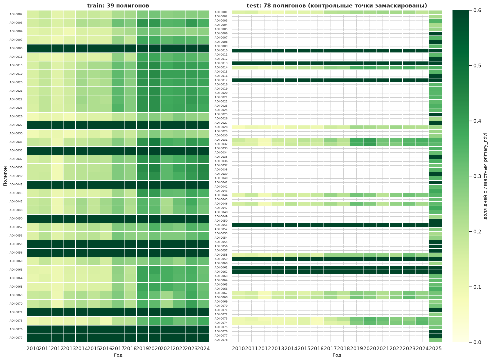

**Следствие для пайплайна.** Любые скользящие окна считать по календарным дням, а не по строкам. У полигонов без сетки колонки ERA5 пусты во всех строках, то есть погодные признаки для них недоступны в принципе, и модель обязана работать без них. В веб-сервисе сборку данных нужно вести на полной ежедневной сетке с погодой, чтобы модель работала в одинаковом режиме.

**Координат нет.** В данных только анонимные `AOI-xxxx` без геометрии, поэтому связать полигоны train/test с реальными контурами из OSM или WorldCereal невозможно. Карта в сервисе будет строиться для новых территорий, собранных самим сервисом, а обучающие данные остаются «безадресными».

**Утечка.** Ни одна контрольная точка test не встречается в train ни по ключу `polygon + date`, ни по году для общих полигонов (у них в test только 2025). Валидация на train должна имитировать обе части test: новые полигоны (2 648 точек) и новый сезон старых полигонов (464 точки).

## 2. Покрытие наблюдениями

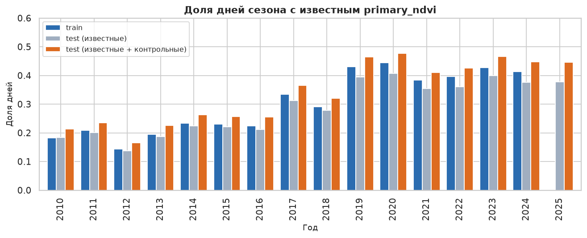

| Период | Доля дней с известным NDVI | Медианный разрыв между наблюдениями |
|---|---|---|
| 2010–2016 | 14–23 % | 6 дней |
| 2017–2018 | 29–34 % | 3 дня |
| 2019–2024 | 39–44 % | 2 дня |
| 2025 (test) | 38 % | — |

Разрывы длиннее 15 дней составляют 1.9 % всех разрывов, длиннее 30 дней практически нет. Рост покрытия с 2017 года — это выход Sentinel-2B и Landsat 9: доля дней с S2 выросла с ~5 % до 25 % в 2024 году.

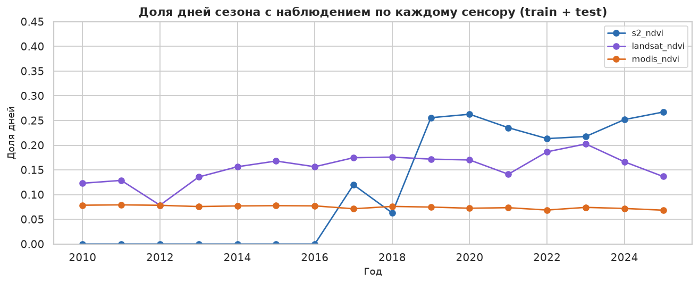
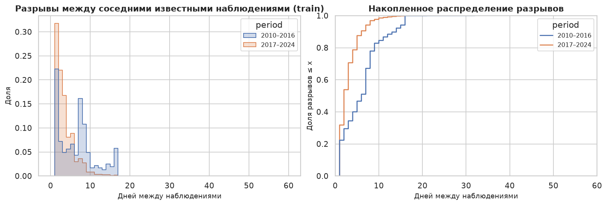

По фазе сезона покрытие ниже в апреле–мае (облачность) и выше в июле–сентябре. На графике по дню года хорошо видны 16-дневные импульсы MODIS.

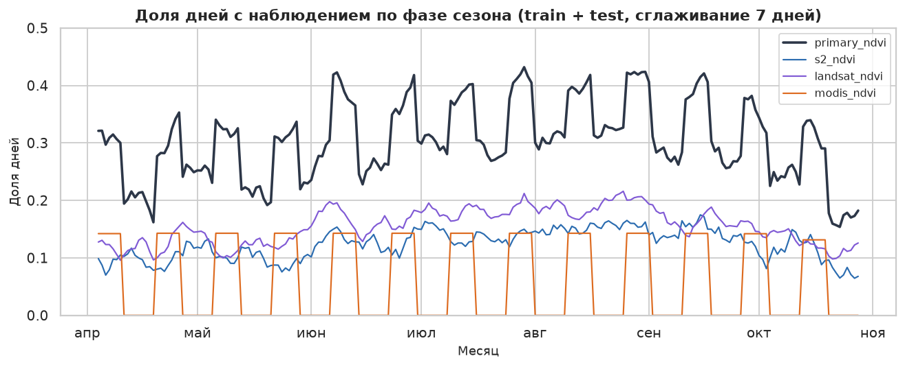

## 3. Как устроен `primary_ndvi`

Правило формирования проверено на всех известных строках: `primary_ndvi = s2_ndvi`, если есть S2; иначе `landsat_ndvi`; иначе `modis_ndvi`. Совпадение 100 %, строк с известным target без единого сенсора нет.

| Источник | Доля известных точек (train + test) |
|---|---|
| Sentinel-2 | 39.6 % |
| Landsat | 41.7 % |
| MODIS | 18.7 % |

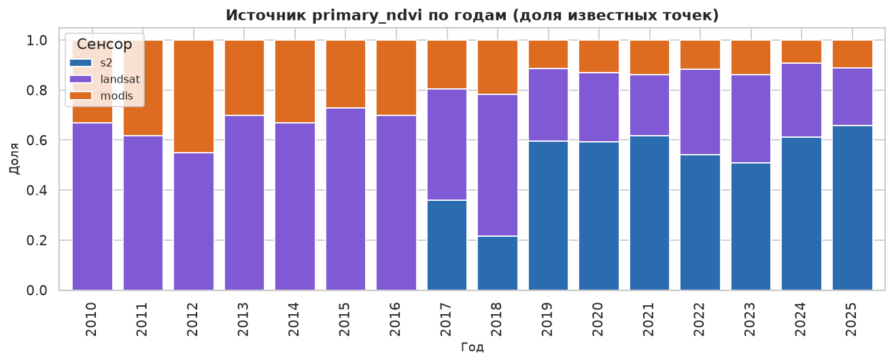

### Согласованность сенсоров

В дни, когда наблюдали два сенсора одновременно:

| Пара | n | Смещение (второй − первый) | RMSE | r |
|---|---|---|---|---|
| S2 vs Landsat | 3 747 | +0.040 | 0.073 | 0.961 |
| S2 vs MODIS | 1 147 | +0.083 | 0.136 | 0.879 |
| Landsat vs MODIS | 1 557 | +0.054 | 0.106 | 0.900 |

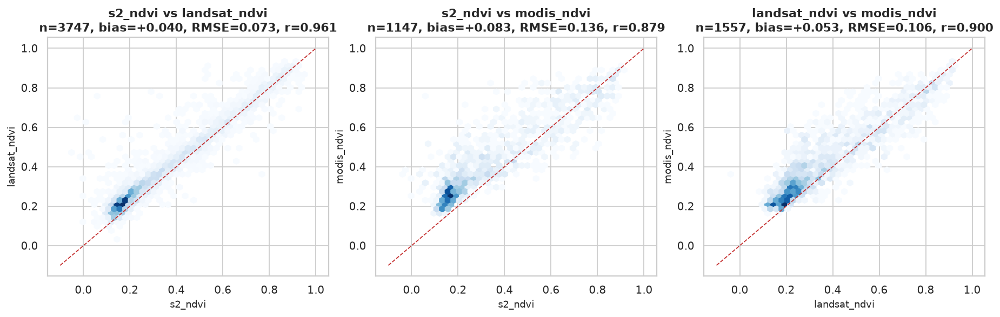

Смещение MODIS максимально в апреле–мае (медиана +0.14 к S2) и снижается летом. Landsat стабильно выше S2 на 0.02–0.06 весь сезон.

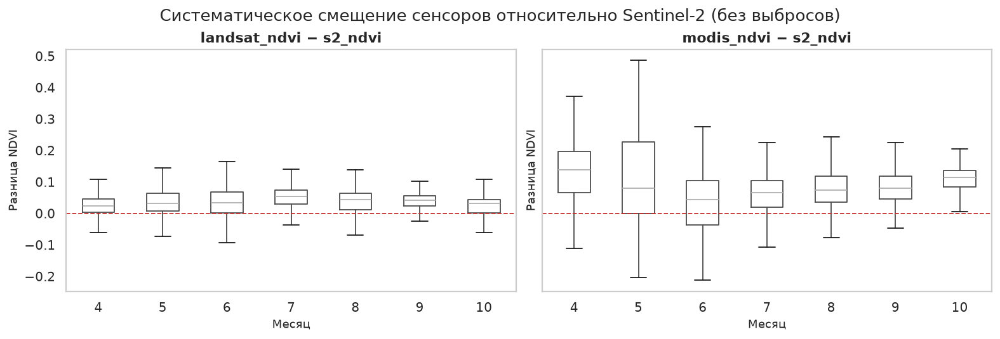

### Выбросы

В train 38 отрицательных значений `primary_ndvi` (27 от S2, 11 от Landsat), 6 из них ниже −0.2, минимум −2.13; ещё 4 значения выше 1 (максимум 1.84, все от Landsat). Это одиночные провалы на фоне ровного ряда, то есть артефакты облаков и теней, а не агрономический сигнал. Такие точки есть и в целевой переменной, значит в ground truth test они тоже могут быть; предсказать их нельзя, но они увеличивают RMSE любой модели.

Вспомогательные индексы грязнее целевого: в `s2_evi` 12 значений порядка 10^11–10^12 (деление на ноль в формуле EVI), в `landsat_ndwi` есть значения от −18 до +12, в `landsat_evi` максимум 3.2. MODIS чист. Перед использованием EVI/NDWI как признаков их нужно обрезать до физического диапазона [−1, 1].

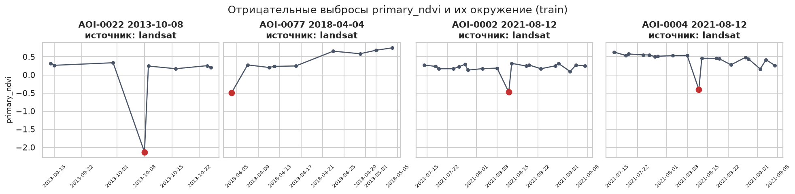

Внутри S2 индексы согласованы: EVI следует за NDVI (r ≈ 0.9), NDWI антикоррелирует.

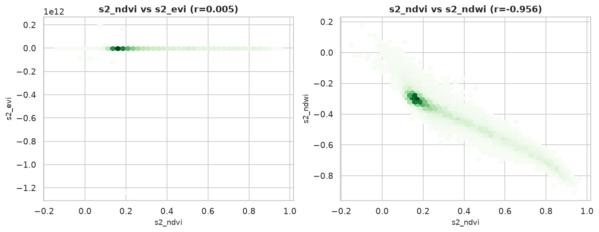

## 4. Циклы съёмки: сенсор по дате

| Сенсор | Шаг между наблюдениями | Что это |
|---|---|---|
| MODIS | 16 дней в 95 % случаев, 32 в 4 % | 16-дневные композиты MOD13Q1, одни и те же 13 дней года для всех полигонов: 97, 113, 129, …, 289 |
| Sentinel-2 | 5 дней (29 %), 2 и 3 дня (24 % и 22 %), 10 дней (8 %) | 5-дневный цикл одной орбиты; шаги 2/3 дня — перекрытие двух орбит |
| Landsat | 8 дней (24 %), 7 дней (23 %), 1 день (26 %), 16 дней (8 %) | 8-дневный цикл пары Landsat 8/9; шаг 1 день — перекрытие соседних витков |

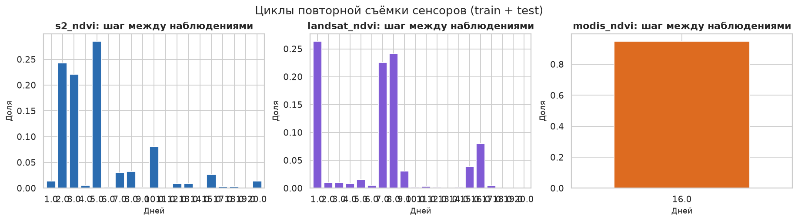

Правило «сенсор по дате»: если остаток номера дня по модулю 5 встречается у S2 того же полигона-года, источник S2; иначе если остаток по модулю 8 встречается у Landsat, источник Landsat; иначе если день года на сетке MODIS, источник MODIS. На train (с исключением самой точки из счётчиков) точность 91.7 %: S2 распознаётся в 100 % случаев, Landsat в 93 %, MODIS в 72 % (MODIS путается с Landsat, когда Landsat в тот день закрыт облаками).

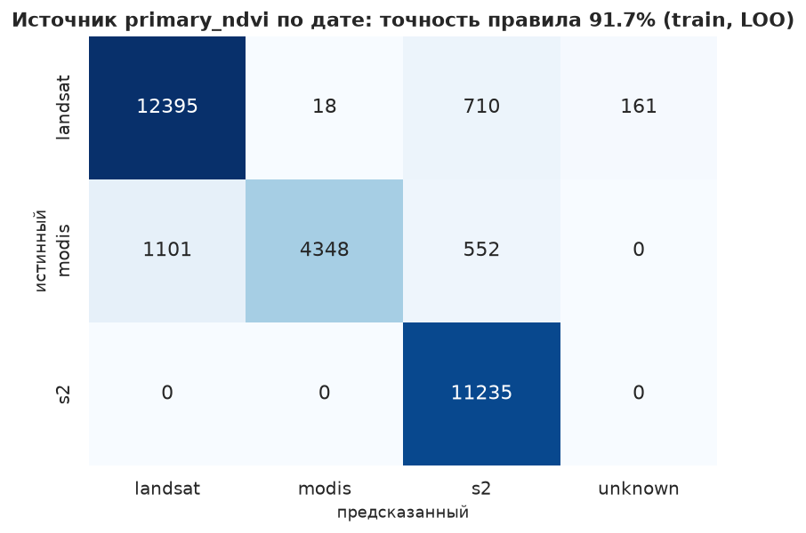

Для контрольных точек test правило предсказывает: S2 1 542, Landsat 1 168, MODIS 383, не определено 19. На сетке MODIS лежат 23 % контрольных точек.

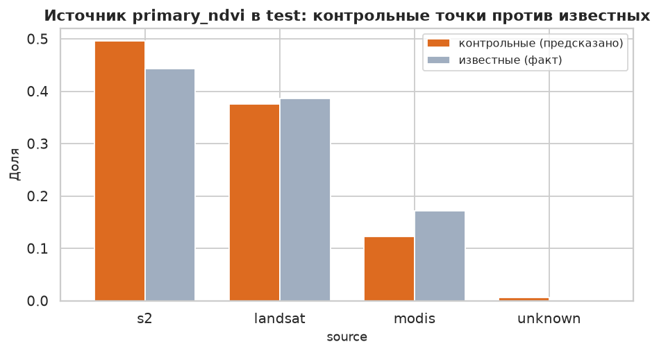

## 5. Сезонность

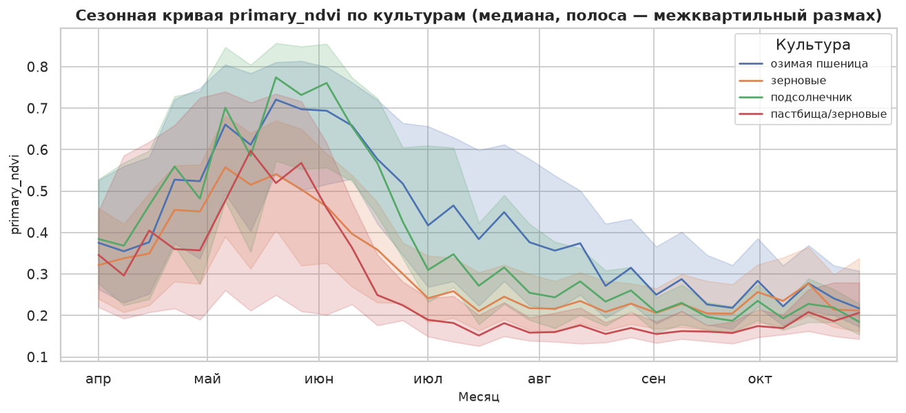

| Культура | Пик (день года) | Медианный NDVI на пике | Медиана за сезон |
|---|---|---|---|
| озимая пшеница | 140 (20 мая) | 0.72 | 0.40 |
| подсолнечник | 140 | 0.77 | 0.31 |
| пастбища/зерновые | 133 | 0.60 | 0.20 |
| зерновые | 126 | 0.56 | 0.28 |

Озимая пшеница держит высокий NDVI до конца июня, остальные классы спадают к июлю. «Подсолнечник» по кривой неотличим от озимой пшеницы: пик в мае, а не в июле, как ожидалось бы для яровой культуры. Разброс дня пика внутри одного полигона по годам в медиане 30 дней, у 18 из 39 полигонов больше 30 дней. Доля полигон-лет с пиком после 1 июля одинакова для всех классов (17–20 %). Вывод: `crop_type` — статичная метка полигона, а не культура конкретного года; для модели она слабый признак, а фактическую фенологию года надо брать из самого ряда.

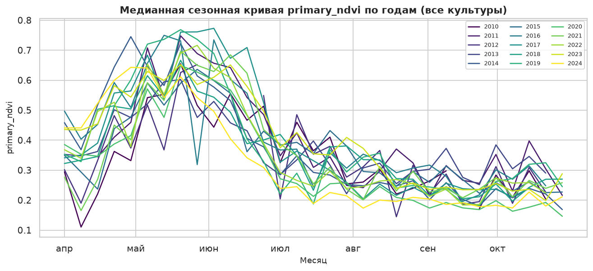

Годы 2020 и 2024 выделяются с июня: медиана NDVI за сезон 0.25 против 0.31–0.38 в остальные годы. 2024 — самый ранний спад.

Распределение `primary_ndvi`: p1 = 0.10, медиана 0.33, p95 = 0.81, p99 = 0.88.

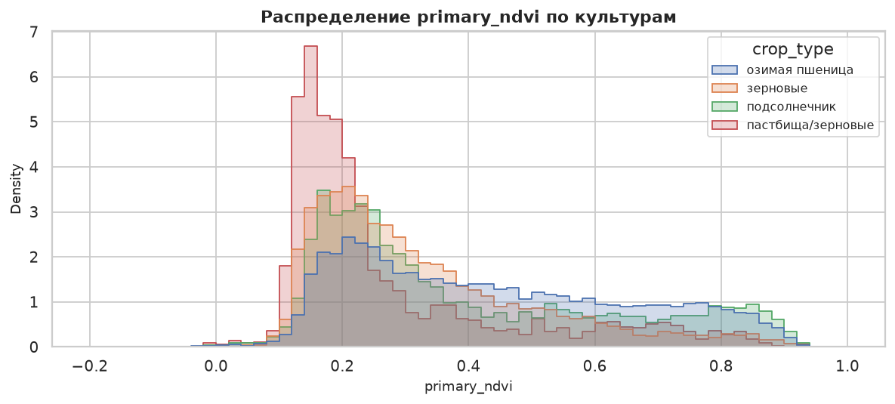

Климатическая норма (`ndvi_climatology_mean ± std`) есть ровно там, где известен `primary_ndvi`, и для одной пары полигон-день года различается между годами (норма считается без текущего года). Копировать её в замаскированные строки нельзя, и как предиктор она слаба (см. раздел 8).

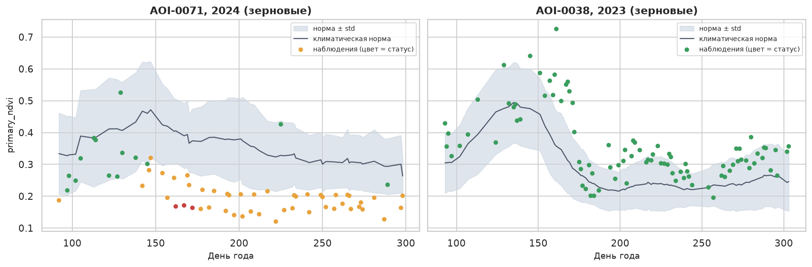
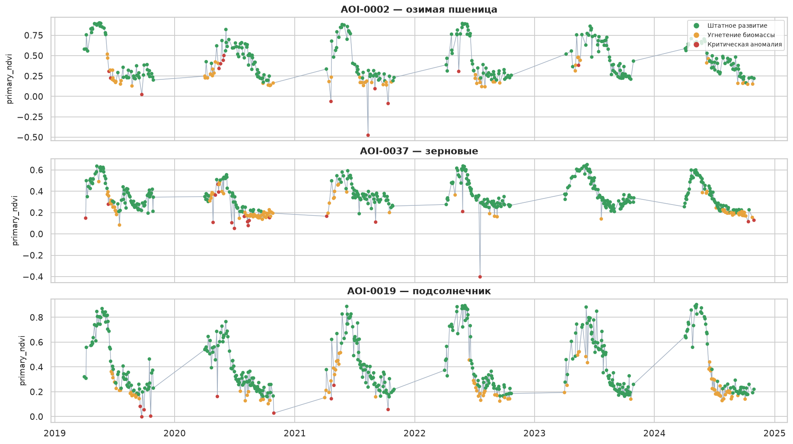

## 6. Аномалии

`status` в train детерминированно задаётся `ndvi_zscore` по порогам ТЗ. Доли: штатное развитие 84.1 %, угнетение биомассы 14.3 %, критическая аномалия 1.7 %.

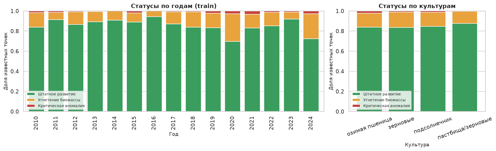

| Год | Доля аномальных точек |
|---|---|
| 2020 | 30.4 % |
| 2024 | 27.8 % |
| 2021 | 17.0 % |
| 2019 | 16.7 % |
| 2016 | 5.7 % (минимум) |

Критическая аномалия чаще у озимой пшеницы (2.2 %), реже на пастбищах (0.5 %).

Z-score: медиана −0.09, p5 = −1.49, p1 = −2.24, минимум −29 (маленькая `std` нормы при большом провале). Тепловая карта «год × месяц» показывает два засушливых сезона: 2020 (июль–октябрь) и 2024 (июнь–октябрь), а также аномально высокий сентябрь 2013.

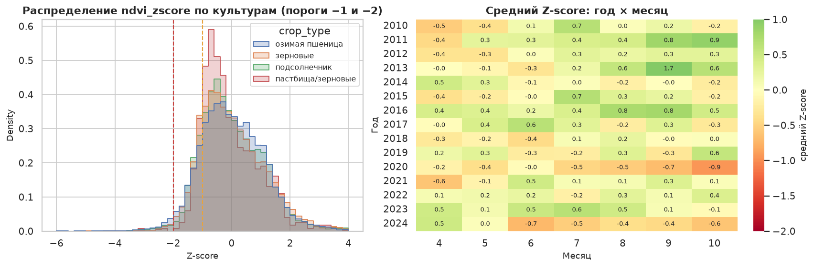

### Погода

Связь Z-score с погодой за 30 дней до наблюдения (только полигоны с ежедневной сеткой): корреляция с аномалией осадков +0.15, с аномалией температуры −0.11. У критических точек средняя аномалия осадков −3 мм за 30 дней, температуры −0.07 °C. Связь есть, но слабая: отклонение от нормы по определению включает смену культуры, ранний спад и артефакты, а не только погодный стресс.

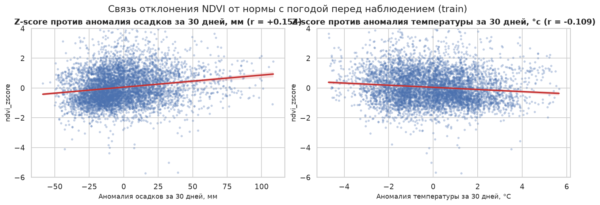
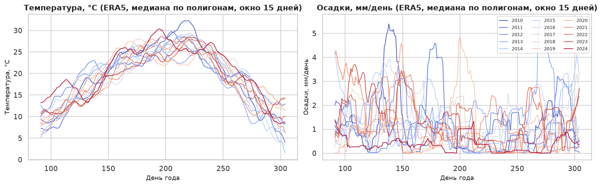

### Эпизоды угнетения

Эпизод — подряд идущие известные точки с Z < −1 в одном полигоне и сезоне. Всего 2 415 эпизодов, 62 % из них — одиночная точка (шум, облако, смена сенсора), 20 % длятся 3 и более точек. В 2020 году 421 эпизод, в 2024 — 299.

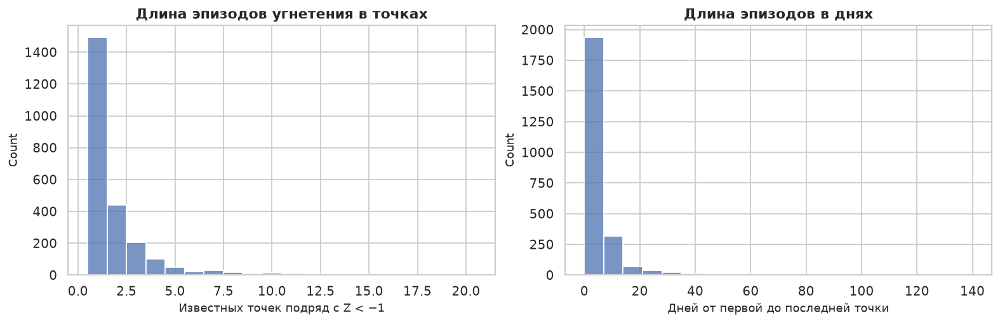

Два самых длинных эпизода иллюстрируют разные причины:

- **AOI-0043, 2019, 86 дней.** NDVI всю весну держится на 0.2, тогда как норма ждёт 0.5–0.6. Поле не засеяно или занято другой культурой. Это агрономическая, а не погодная аномалия.
- **AOI-0065, 2024, 80 дней.** Озимая пшеница развивалась выше нормы до начала июня, затем за три недели упала с 0.67 до 0.2 на фоне дефицита осадков. Ранний спад в засушливый год.

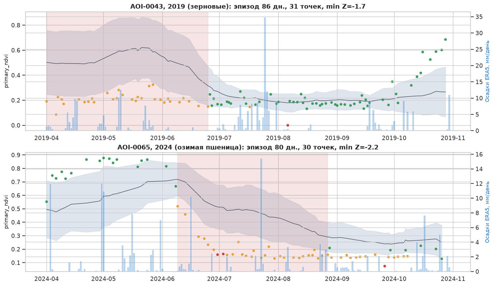

## 7. Контрольные точки test

| Показатель | Значение |
|---|---|
| Контрольных точек | 3 112 |
| На новых полигонах / на старых (2025) | 2 648 / 464 |
| Доля замаскированных среди исходно известных | 13–17 % в каждом году |
| Точек в 2025 году | 925 (там все 78 полигонов) |
| Расстояние до ближайшего известного соседа | медиана 2 дня, q75 = 3, q90 = 6 |
| В пределах 3 / 7 / 15 дней | 79 % / 95 % / 99 % |
| Известных точек в окне ±15 / ±30 дней | медиана 7 / 15 |
| Без соседа слева в сезоне / справа | 2.3 % / 1.8 %, без обоих — 0 |
| Сенсор ближайшего соседа | Landsat 1 376, S2 1 210, MODIS 526 |

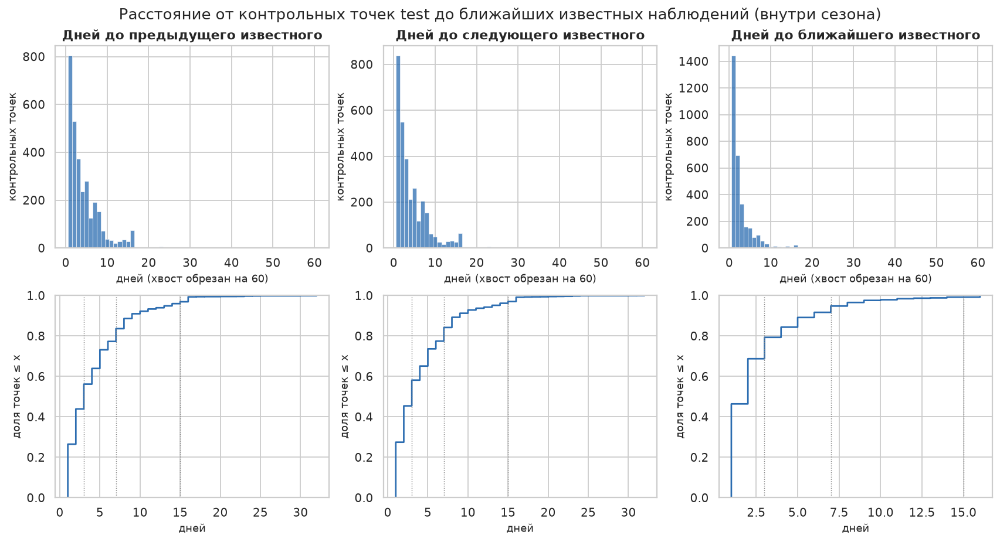
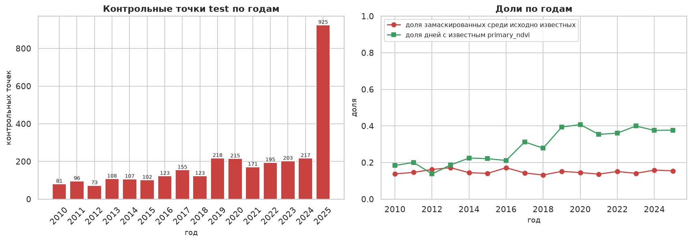
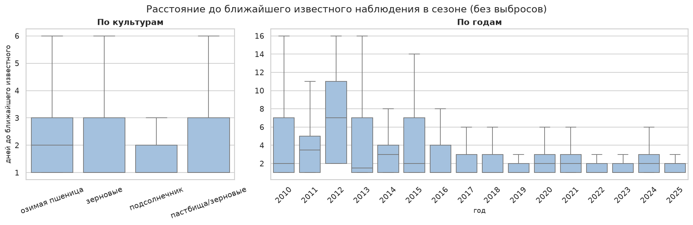
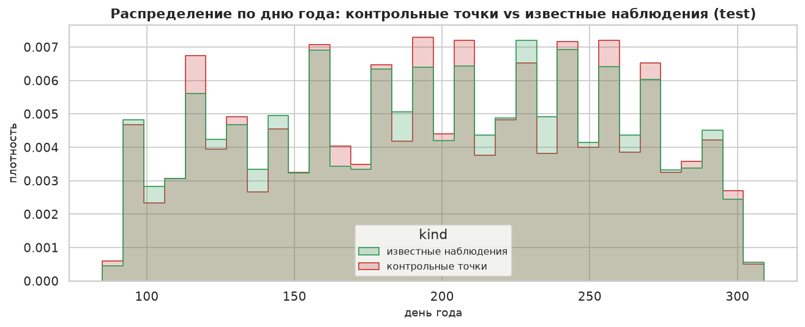
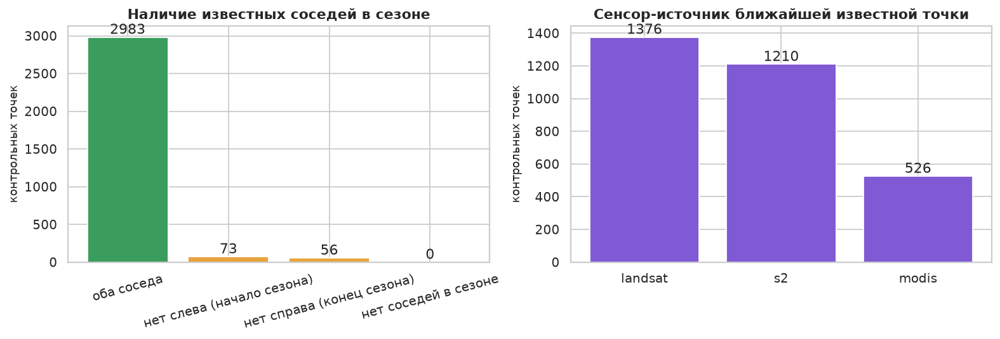

Контрольные точки распределены по сезону так же, как известные наблюдения, то есть выбраны случайно среди известных. Медиана расстояния одинакова для всех культур (1–2 дня).

## 8. Baseline

3 000 синтетических пропусков на train (9.8 % известных точек, равномерно по полигон-годам, `RANDOM_SEED = 42`). Распределение расстояний до соседей совпадает с test: медиана 2 дня в обоих случаях, KS = 0.09.

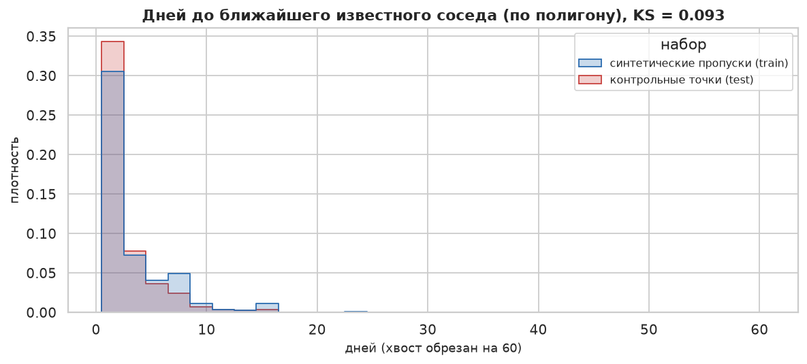

| Метод | RMSE | MAE | GapScore |
|---|---|---|---|
| среднее двух соседей (baseline ТЗ) | 0.0933 | 0.067 | 2.0 |
| линейная интерполяция по времени | 0.0944 | 0.068 | 1.7 |
| ближайшая точка | 0.107 | 0.077 | 0 |
| среднее интерполяции и климатологии | 0.107 | 0.081 | 0 |
| климатология из строки | 0.159 | 0.119 | 0 |
| своя климатология по doy (±7 дней, другие годы) | 0.160 | 0.120 | 0 |

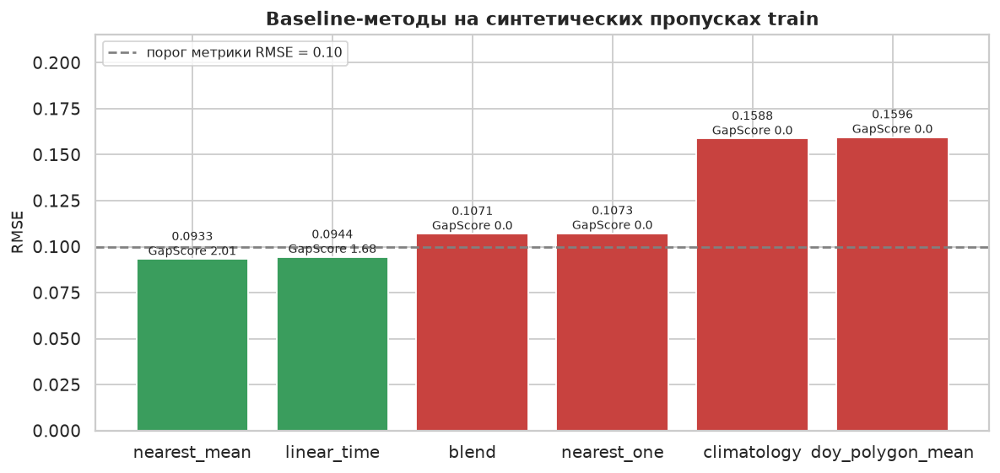

RMSE baseline почти не зависит от расстояния до соседа: 0.090 при 1–3 днях, 0.103 при 4–7, 0.095 при 8–15, 0.094 при 16–30. По культурам хуже всего озимая пшеница (0.100) и подсолнечник (0.095), лучше зерновые (0.079) и пастбища (0.074). По годам хуже 2011–2012 (0.105–0.108), лучше 2024 (0.073).

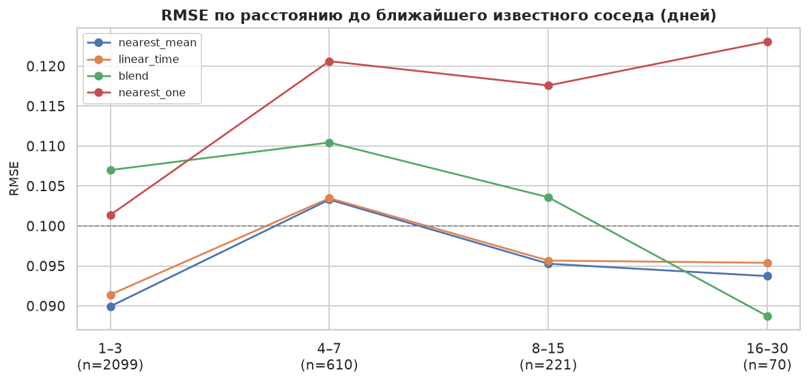

### Откуда ошибка

| Сенсоры соседей относительно скрытой точки | n | RMSE baseline |
|---|---|---|
| оба соседа того же сенсора | 537 | **0.065** |
| один сосед другого сенсора | 1 246 | 0.083 |
| оба соседа другого сенсора | 1 217 | **0.112** |

Только 18 % пропусков окружены соседями того же сенсора. Остальное — смесь, и именно межсенсорное смещение даёт основную часть ошибки. Ошибки baseline симметричны и тяжелохвосты.

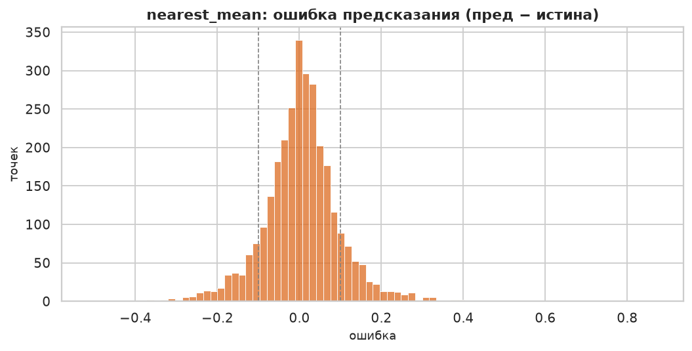
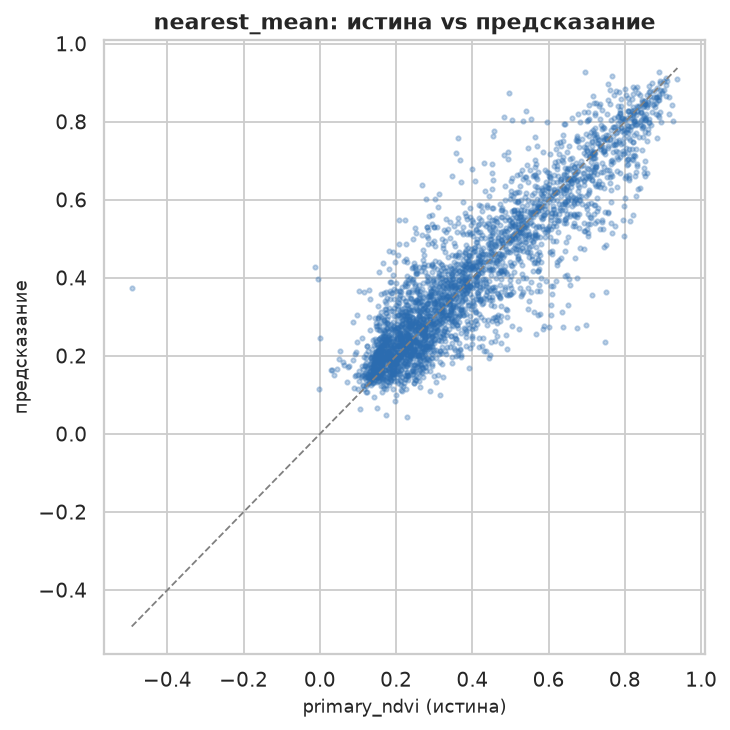

## 9. Выводы для моделирования

**Задача 1 (GapScore).**

1. Это задача локального шумоподавления с учётом сенсора, а не интерполяции длинных пропусков. Верхняя оценка выигрыша: если снять межсенсорное смещение, RMSE стремится к 0.065, то есть GapScore около 10 вместо 2.
2. Предсказывать сенсор скрытой точки по дате (правило из раздела 4 или классификатор на остатках по циклам, 92 %+), затем приводить соседние значения к шкале этого сенсора (смещения по паре сенсоров, месяцу и полигону) и только потом усреднять или интерполировать.
3. Дальше — градиентный бустинг на признаках: k ближайших известных точек с каждой стороны (значение, сенсор, расстояние), их гармонизированные версии, предсказанный сенсор, день года, год, статистики полигона, сглаженное значение (Whittaker или Savitzky–Golay по гармонизированному ряду), ERA5 (там, где есть сетка). Робастная функция потерь из-за выбросов в target, предсказание в диапазоне [−0.1, 1].
4. Валидация: синтетические пропуски как в `eda/baseline.py`, GroupKFold по полигонам плюс hold-out последнего сезона, чтобы покрыть обе части test (новые полигоны и новый год).
5. Полигоны без ежедневной сетки — отдельный режим: у них нет погодных признаков между наблюдениями, модель не должна на них ломаться.

**Задача 2 (аномалии).**

1. Z-score по климатологии воспроизводит `status` точно, так что базовая детекция бесплатна. Ценность — в эпизодах (2+ подряд точек или ≥ 7 дней) и в объяснении причины.
2. Типы причин, различимые по данным: (а) поле не засеяно или сменилась культура — плоский ряд с весны; (б) ранний спад или уборка — резкое падение относительно нормы при высоком старте; (в) погодный стресс — спад на фоне дефицита осадков и жары за 30 дней; (г) артефакт данных — одиночная точка, отрицательный NDVI, смена сенсора. Эти признаки стоит вычислять явно и отдавать LLM-агенту как структурированные факты для интерпретации.
3. 2020 и 2024 — готовые демонстрационные сезоны для презентации.

**Пайплайн сервиса.** Чтобы модель переносилась на новые территории, сборка данных в сервисе должна воспроизводить ту же конструкцию: ежедневная сетка, `primary_ndvi` по приоритету S2 → Landsat → MODIS (MOD13Q1, 16-дневная сетка), ERA5 по дням.

## 10. Ограничения и открытые вопросы

- Синтетические пропуски равномерны по полигон-годам; в test 30 % точек в 2025 году, где покрытие похоже на 2019–2024, поэтому по годам взвешивать не стали.
- Сенсорные смещения оценены глобально; по полигонам и культурам они могут отличаться, это проверит модель.
- Природа полигонов без сетки неизвестна (возможно, разная выгрузка организаторов); в test их 23 из 78, поэтому обрабатывать их надо аккуратно.
- Метка `crop_type` статична; фактическую культуру года лучше выводить из формы кривой.
